# Teotl

Teotl is a turn based competitive game; both players chose their elemental and have them battle each other. Turns are taken simultaneously; The player that wins has each battle has it's ability go off which strengthens your elementals for the next turn. The game plays out like a series of rock paper scissors matches, the arrows on the pentacle show which elemental is strong against it's opponent.

You can find the latest build [here](https://www.dropbox.com/sh/i1j0xwpzd2hs6oc/AADKhoUzIVtaEhuHKhlLVYSma?dl=0)

## Stats

Every Elemental has a set of stats that decide what they do in combat:

**Strength:** Decides how much *Damage* the elemental can do during combat. 
**Constitution:** Decides *Health* and *Defense*. 
**Inteligence:** Decides the *Ability Modifier* which decides how potent the elementals *ability* is. 
**Agility:** Decides the Elementals *Speed* which decides who goes first during combat. 
**Ability:** Every Elemental has a unique *ability* that triggers if the Elemental *wins* the round

## Elementals
### Atomic

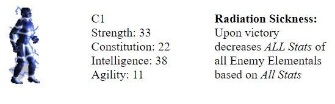

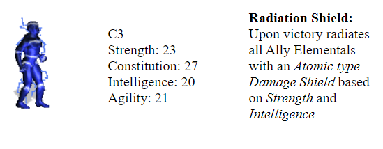
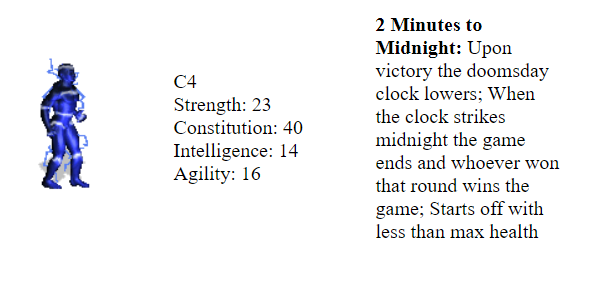

### Fire

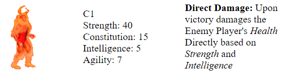
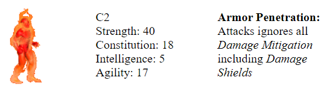
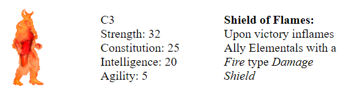
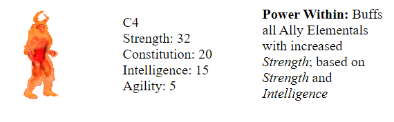

### Water

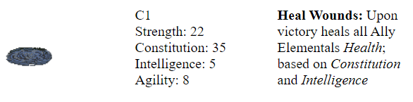
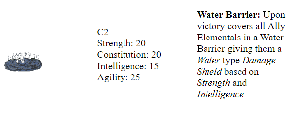
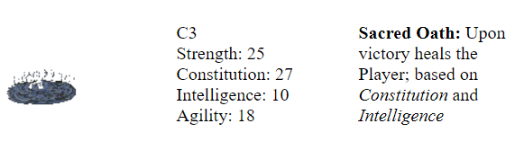
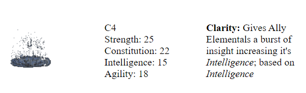

### Earth

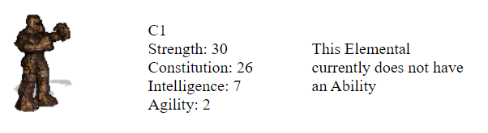

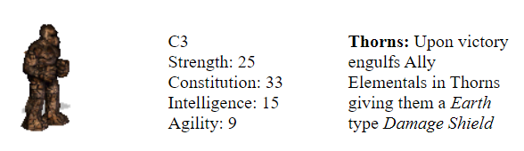
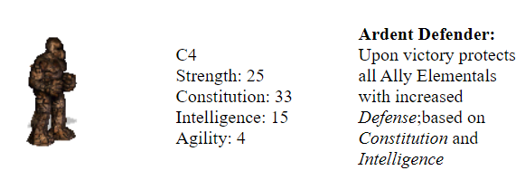

### Wind

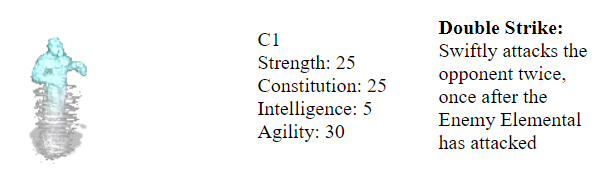
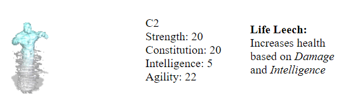
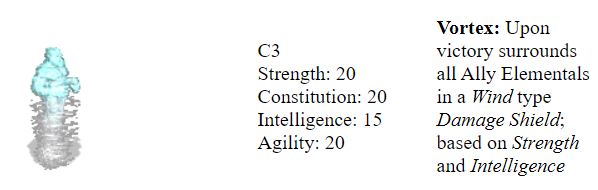
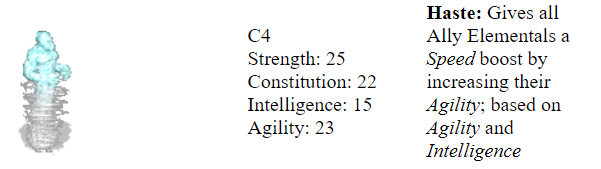